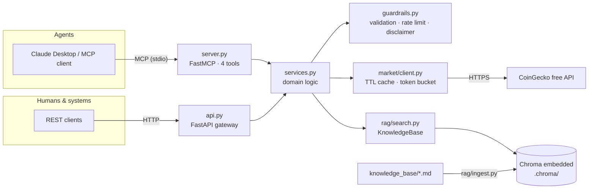

# crypto-insight-mcp

[](https://github.com/IgorAbramov/crypto-insight-mcp/actions/workflows/ci.yml)
[](LICENSE)
[](pyproject.toml)

**An MCP server that gives AI agents governed access to crypto market data and a
company knowledge base** — live prices and portfolio analytics from CoinGecko,
plus RAG-based semantic search over internal documents (regulation, AML/KYC,
custody, listing policy), with responsible-AI guardrails at every boundary.

## Why this project

Connecting an LLM to a financial domain is easy to do badly: unvalidated tool
inputs, upstream stack traces leaking into model context, retrieved documents
silently rewritten into confident "advice". This project demonstrates the
architecture I consider correct for the problem:

- **One domain, two transports.** All business logic lives in a pure service
  layer. An MCP server (stdio) exposes it to AI agents; a FastAPI gateway
  exposes the same functions to humans and systems. Neither transport contains
  logic, so behaviour and guardrails cannot drift between them.
- **Guardrails as a first-class module.** Input validation with LLM-actionable
  error messages, outbound rate limiting, mandatory not-financial-advice
  disclaimers on every analytical response, structured `{"error": ...}`
  payloads instead of exceptions crossing the protocol boundary.
- **Retrieval, not server-side synthesis.** The RAG tool returns chunks with
  sources; the calling LLM does the reasoning. This division of labour is
  recorded in [ADR-0003](docs/adr/0003-guardrails-and-retrieved-chunks-pattern.md).
- **Runs anywhere, no keys.** CoinGecko free tier, embedded Chroma, local ONNX
  embeddings with a deterministic offline fallback. `pytest` passes with no
  network at all ([ADR-0002](docs/adr/0002-embedded-chroma-and-local-embeddings.md)).

## MCP tools

| Tool | Arguments | Returns |
| --- | --- | --- |
| `get_price` | `symbols: list[str]`, `vs_currency="usd"` | Spot price + 24h change per symbol |
| `get_market_history` | `symbol: str`, `days=30`, `vs_currency="usd"` | Daily price points + min/max/change stats |
| `analyze_portfolio` | `holdings: dict[symbol, amount]`, `vs_currency="usd"` | Total value, per-position allocation %, HHI concentration index, warnings |
| `search_knowledge` | `query: str`, `k=4` | Top-k knowledge-base chunks with `source` and `score` |

Every analytical response includes a `disclaimer` field; every invalid input
produces `{"error": "<what was wrong and what is acceptable>"}` rather than a
crash.

## Architecture



More detail in [docs/architecture.md](docs/architecture.md) and the
[ADRs](docs/adr/).

## Quickstart

Requires Python ≥ 3.10.

```bash
git clone https://github.com/IgorAbramov/crypto-insight-mcp.git
cd crypto-insight-mcp
pip install -e ".[dev]"

# Build the knowledge-base index (embedded Chroma, local embeddings).
python -m crypto_insight_mcp.rag.ingest

# Run the offline test suite.
pytest
```

### Connect to Claude Desktop

Add to `claude_desktop_config.json` (Settings → Developer → Edit Config):

```json
{
  "mcpServers": {
    "crypto-insight": {
      "command": "crypto-insight-mcp",
      "env": {
        "CIM_CHROMA_DIR": "/absolute/path/to/crypto-insight-mcp/.chroma"
      }
    }
  }
}
```

If `crypto-insight-mcp` is not on Claude Desktop's PATH, use the absolute path
to the script (`which crypto-insight-mcp`) or
`"command": "python", "args": ["-m", "crypto_insight_mcp.server"]` with the
right interpreter. Restart Claude Desktop; then try:

> *What are BTC and ETH trading at? Then check what our listing policy says
> about delisting notice periods.*

### Run the REST gateway

```bash
uvicorn crypto_insight_mcp.api:app --reload
# http://127.0.0.1:8000/docs           — OpenAPI UI
# GET  /health
# GET  /prices?symbols=BTC,ETH&vs=usd
# POST /portfolio/analyze              {"holdings": {"BTC": 0.5, "ETH": 10}}
# GET  /knowledge/search?q=custody%20segregation&k=4
```

Or with Docker:

```bash
docker compose up --build api   # ingests on start, serves on :8000
```

### Run the agent demo (human-in-the-loop)

```bash
# Offline scripted mode — no LLM, no keys (needs internet for CoinGecko):
python agent_demo/demo.py "0.5 BTC, 10 ETH, 5000 USDT"

# Real tool-use loop through the Anthropic API:
pip install -e ".[agent]"
export ANTHROPIC_API_KEY=...   # see .env.example
python agent_demo/demo.py "0.5 BTC, 10 ETH, 5000 USDT" --llm
```

The demo walks the agent workflow — prices → portfolio analysis →
knowledge-base grounding → draft risk note — and then **stops for human
approval** before "executing" the proposed action (execution is simulated;
nothing is ever traded or sent).

## Responsible AI & guardrails

- **Input validation at every tool boundary** — symbols, query text, day
  ranges and holdings are validated and normalised; violations return messages
  that tell the LLM what was wrong *and what acceptable values look like*, so
  the agent can self-correct instead of retry-looping.
- **Rate limiting** — a thread-safe token bucket in front of CoinGecko keeps a
  misbehaving agent from hammering a third-party API.
- **Mandatory disclaimers** — every analytical payload carries
  `"Informational market data / document retrieval only. This is NOT
  financial, investment, legal or tax advice."` The server's MCP instructions
  direct clients to surface it.
- **No stack traces in model context** — upstream failures map to short, safe
  `MarketDataError` messages; tool handlers convert all handled errors to
  structured `{"error": ...}` payloads, so the server never crashes on bad
  input.
- **Human-in-the-loop** — the agent demo requires explicit approval before any
  consequential action; the default answer is "no".
- **Retrieved chunks, not synthesized answers** — `search_knowledge` returns
  sourced chunks and leaves synthesis to the client LLM
  ([ADR-0003](docs/adr/0003-guardrails-and-retrieved-chunks-pattern.md)).

## Testing

The suite runs **fully offline**: CoinGecko is mocked with
`httpx.MockTransport`, embeddings use a deterministic hash fallback, Chroma
lives in per-test temp directories, and the MCP surface is exercised
in-process (`mcp.list_tools()` / `mcp.call_tool()`).

```bash
pytest        # 64 tests, ~1.5 s
ruff check .  # lint
```

CI (GitHub Actions) runs lint + tests on every push and pull request with no
secrets configured — by design.

## Project layout

```
src/crypto_insight_mcp/
├── server.py        # MCP transport (FastMCP, stdio)
├── api.py           # REST transport (FastAPI)
├── services.py      # domain logic shared by both
├── guardrails.py    # validation, rate limiting, disclaimers
├── market/client.py # CoinGecko client: TTL cache, rate limit
└── rag/             # embeddings (ONNX + offline fallback), ingest, search
knowledge_base/      # sample corpus: MiCA, AML/KYC, custody, listing policy
agent_demo/demo.py   # human-in-the-loop agent scenario (offline + --llm)
docs/                # architecture.md + ADRs
tests/               # offline test suite
```

## Roadmap

- Pinecone/managed vector-store adapter behind the existing LangChain
  interface (the embedded-Chroma trade-off is documented in ADR-0002).
- Kubernetes manifests for the REST gateway.
- Retrieval evaluation harness (golden questions → recall/precision on the
  knowledge base) to make RAG quality measurable, not anecdotal.
- Symbol resolution fallback via CoinGecko `/search` for long-tail assets.

## Author

**Igors Abramovs** — [github.com/IgorAbramov](https://github.com/IgorAbramov)

MIT License — see [LICENSE](LICENSE).
