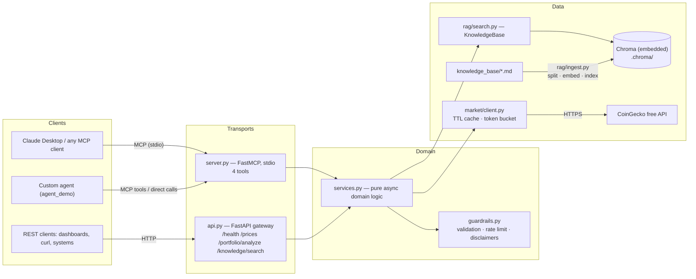

# Architecture

`crypto-insight-mcp` is one domain exposed through two transports: an MCP
server (stdio) for AI agents and a FastAPI gateway (HTTP) for humans and
systems. Both are thin adapters over the same service layer, so guardrails,
disclaimers and error semantics are enforced identically regardless of who is
calling.

## System diagram

## Layers

**Transports** (`server.py`, `api.py`). Each MCP tool / HTTP route is a
few-line wrapper: call the service, map handled exceptions to a structured
error (`{"error": ...}` over MCP; 400/502/503 over HTTP). No business logic
lives here, which is what makes the double exposure cheap and safe.

**Domain services** (`services.py`). Pure async functions: price lookup,
market history with statistics, portfolio valuation with HHI concentration
scoring, knowledge-base search. Dependencies are injectable for tests;
process-wide lazy singletons are used by default. Every function validates
inputs through guardrails first and stamps analytical outputs with the
mandatory disclaimer.

**Guardrails** (`guardrails.py`). The responsible-AI choke point: symbol /
query / days / holdings validators with LLM-actionable error messages, a
thread-safe token bucket for outbound API calls, and the disclaimer helper.
See ADR-0003.

**Market data** (`market/client.py`). Async CoinGecko client (free tier, no
key) with an in-memory TTL cache keyed by path+params and rate limiting.
HTTP failures map to `MarketDataError` messages that are safe to place into
model context (no stack traces, no parameterised URLs).

**RAG** (`rag/`). `ingest.py` splits `knowledge_base/*.md`
(RecursiveCharacterTextSplitter, 800/120) and indexes chunks into embedded
Chroma with `{"source": filename}` metadata, recording which embedding
backend built the index. `embeddings.py` provides ONNX MiniLM-L6-v2 with a
deterministic hash-based offline fallback (ADR-0002). `search.py` returns
`{source, snippet, score}` chunks — never synthesised answers (ADR-0003).

## Data flows

**Price query (agent).** Claude calls `get_price(["BTC"])` → guardrails
normalise and validate symbols → cache hit? return; else token bucket →
CoinGecko `/simple/price` → mapped response + disclaimer → Claude presents
the data with the disclaimer.

**Portfolio analysis.** `analyze_portfolio({"BTC": 0.5, ...})` → holdings
validated (zero positions dropped) → one batched price call → valuation,
allocation percentages, HHI, warnings → disclaimer → the agent reasons about
the result; any follow-up action goes through a human approval gate
(`agent_demo/demo.py`).

**Knowledge question.** `search_knowledge("MiCA custody requirements")` →
query sanitised → embedded → Chroma similarity search → top-k chunks with
sources → the *client* LLM synthesises an answer and cites sources.

**Ingestion (operator).** `python -m crypto_insight_mcp.rag.ingest` →
rebuild collection from scratch (idempotent, no duplicate chunks) → chunk
count printed.

## Error-handling contract

| Failure | MCP response | REST response |
| --- | --- | --- |
| Invalid input (`GuardrailViolation`) | `{"error": msg}` | 400 + `{"error": msg}` |
| Upstream market failure (`MarketDataError`) | `{"error": msg}` | 502 + `{"error": msg}` |
| Index missing/unusable (`KnowledgeBaseError`) | `{"error": msg}` | 503 + `{"error": msg}` |

All three messages are written for LLM consumption: they state what was
wrong and what acceptable input looks like, and never include stack traces.

## Testing strategy

Everything runs offline: CoinGecko is replaced by `httpx.MockTransport`,
embeddings by the deterministic hash fallback, Chroma by per-test temp
directories. The MCP surface is tested in-process through
`mcp.list_tools()` / `mcp.call_tool()` — no subprocess, no network, <2 s for
the suite.
